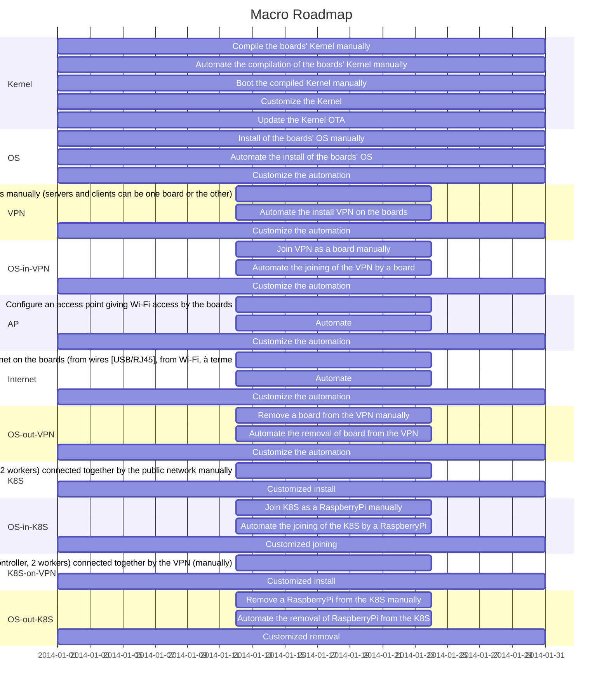

# Project management

## Roadmap

The term `board` in the following section targets the Wallys Board or the RaspberryPi.

```mermaid
gantt
    title Macro Roadmap
    dateFormat  YYYY-MM-DD
    section Kernel
    Compile the boards' Kernel manually           :os, 2014-01-01, 30d
    Automate the compilation of the boards' Kernel manually           :os, 2014-01-01, 30d
    Boot the compiled Kernel manually           :os, 2014-01-01, 30d
    Customize the Kernel           :osCustomizedUnattended, 2014-01-01, 30d
    Update the Kernel OTA          :os, 2014-01-01, 30d
    section OS
    Install of the boards' OS manually           :os, 2014-01-01, 30d
    Automate the install of the boards' OS           :osUnattended, 2014-01-01, 30d
    Customize the automation           :osCustomizedUnattended, 2014-01-01, 30d
    section VPN
    Install VPN on the boards manually (servers and clients can be one board or the other)      :2014-01-12  , 12d
    Automate the install VPN on the boards      :2014-01-12  , 12d
    Customize the automation           :osCustomizedUnattended, 2014-01-01, 30d
    section OS-in-VPN
    Join VPN as a board manually      :2014-01-12  , 12d
    Automate the joining of the VPN by a board     :2014-01-12  , 12d
    Customize the automation           :osCustomizedUnattended, 2014-01-01, 30d
    section AP
    Configure an access point giving Wi-Fi access by the boards      :2014-01-12  , 12d
    Automate     :2014-01-12  , 12d
    Customize the automation           :osCustomizedUnattended, 2014-01-01, 30d
    section Internet
    Configure internet on the boards (from wires [USB/RJ45], from Wi-Fi, à terme: from cellular):2014-01-12  , 12d
    Automate     :2014-01-12  , 12d
    Customize the automation           :osCustomizedUnattended, 2014-01-01, 30d
    section OS-out-VPN
    Remove a board from the VPN manually      :2014-01-12  , 12d
    Automate the removal of board from the VPN     :2014-01-12  , 12d
    Customize the automation           :osCustomizedUnattended, 2014-01-01, 30d
    section K8S
    Install K8S on 3 RaspberryPi boards (1 controller, 2 workers) connected together by the public network manually      :2014-01-12  , 12d
    Customized install           :osCustomizedUnattended, 2014-01-01, 30d
    section OS-in-K8S
    Join K8S as a RaspberryPi manually      :2014-01-12  , 12d
    Automate the joining of the K8S by a RaspberryPi     :2014-01-12  , 12d
    Customized joining            :osCustomizedUnattended, 2014-01-01, 30d
    section K8S-on-VPN
    Install K8S on 3 RaspberryPi boards (1 controller, 2 workers) connected together by the VPN (manually)      :2014-01-12  , 12d
    Customized install           :osCustomizedUnattended, 2014-01-01, 30d
    section OS-out-K8S
    Remove a RaspberryPi from the K8S manually      :2014-01-12  , 12d
    Automate the removal of RaspberryPi from the K8S     :2014-01-12  , 12d
    Customized removal           :osCustomizedUnattended, 2014-01-01, 30d
```

/!\ Put in place a certificate rotation with high rate
